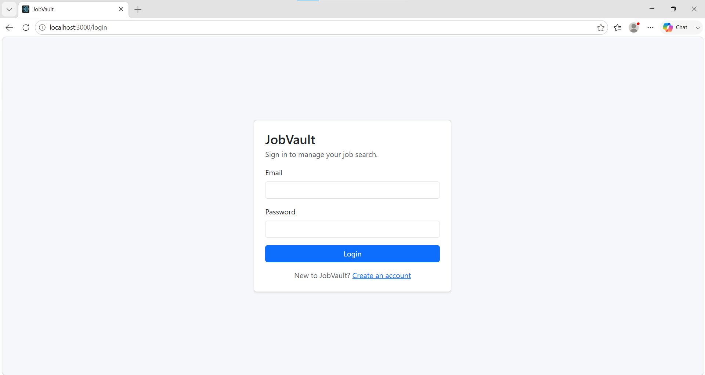
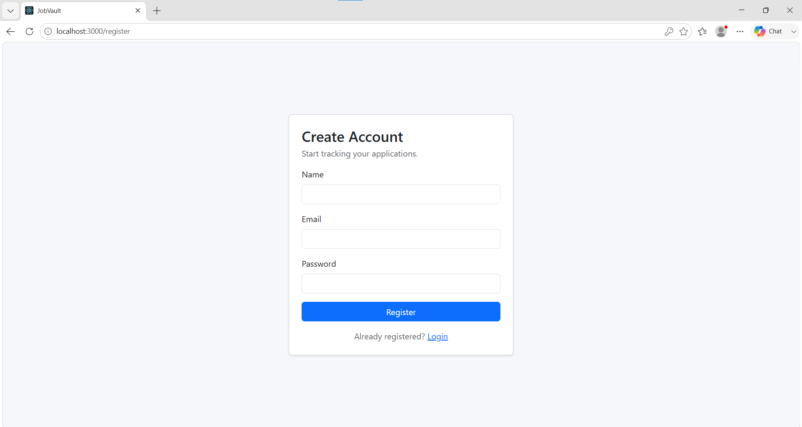
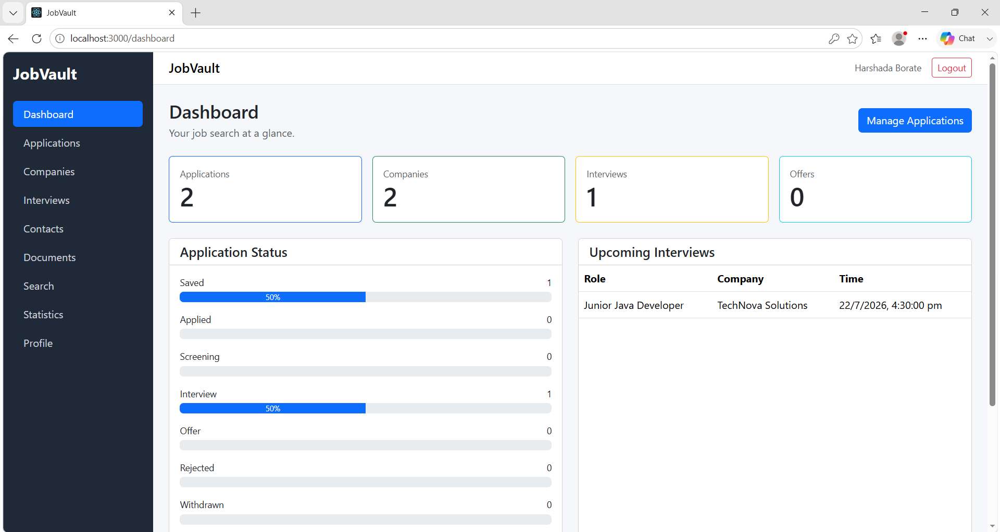
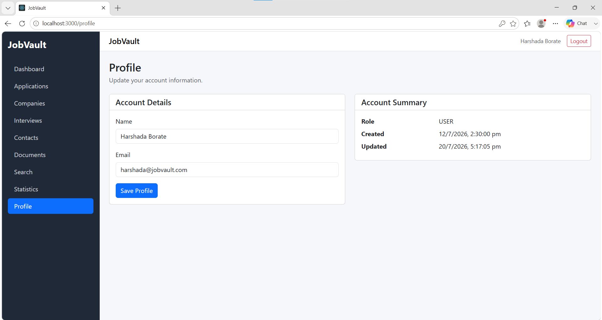
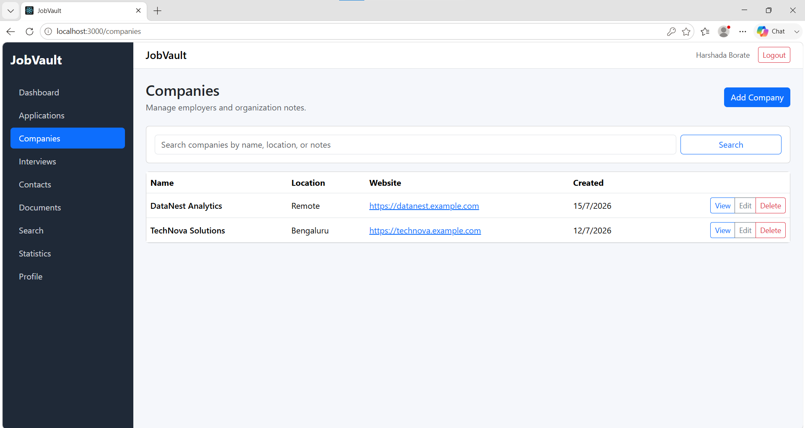
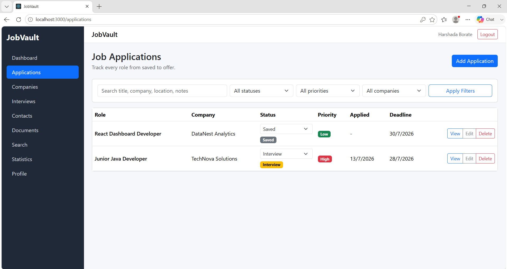
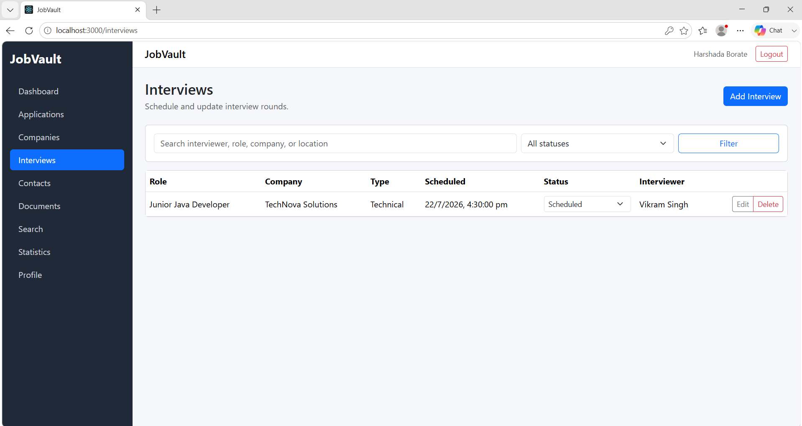
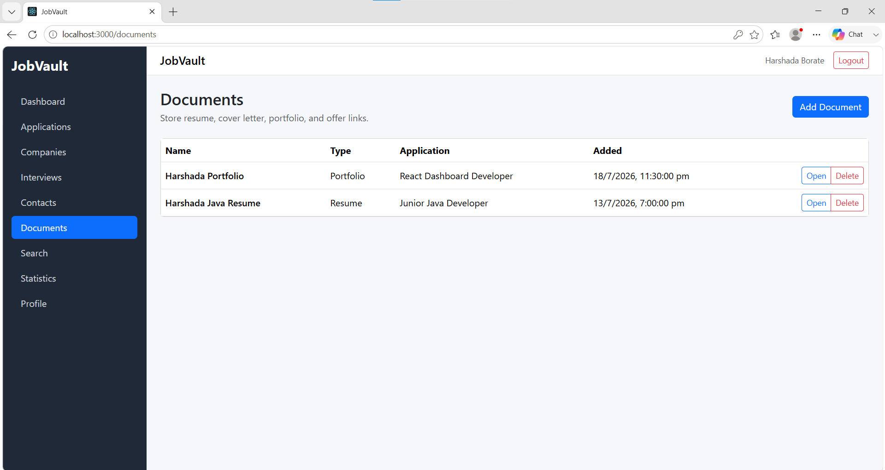
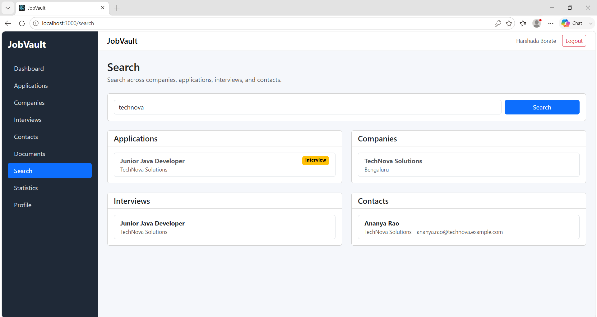
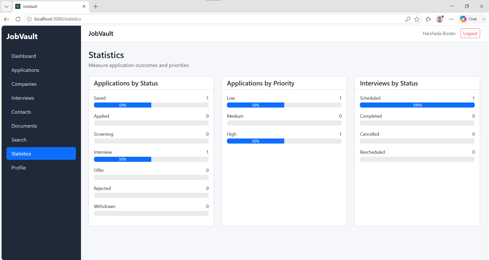

# JobVault

JobVault is a full stack web application developed using Spring Boot, React, and MySQL. It helps users manage their job applications, companies, interviews, contacts, and documents in one place.

## Features

- User Registration and Login
- JWT Authentication
- Dashboard
- Profile Management
- Company Management
- Job Application Tracking
- Interview Scheduling
- Contact Management
- Document Management
- Search and Filters
- Statistics

## Tech Stack

**Backend**
- Java 21
- Spring Boot
- Spring Security
- JWT
- Spring Data JPA
- MySQL
- Maven

**Frontend**
- React
- Bootstrap 5
- Axios
- React Router

**Database**
- MySQL
- XAMPP
- phpMyAdmin

## Screenshots

### Login


### Register


### Dashboard


### Profile


### Companies


### Applications


### Interviews


### Documents


### Search


### Statistics


## How to Run

1. Start Apache and MySQL using XAMPP.
2. Import `database/jobvault.sql` into phpMyAdmin.
3. Run the backend project in Eclipse.
4. Open the `frontend` folder and run:

```bash
npm install
npm start
```

5. Open `http://localhost:3000` in your browser.
6. Register a new account and start using JobVault.
   
